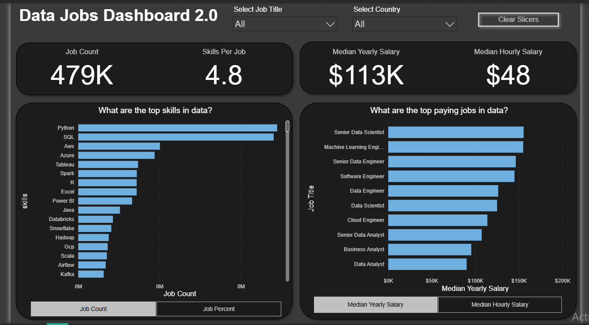

# 📊 Power BI Project 2 – Data Jobs Dashboard 2.0

This repository contains **Power BI Project 2**, an advanced version of my previous [Data Jobs Dashboard (Project 1)](https://github.com/KhushiSoni-78/PowerBI-data-jobs-dashboard).  
Both projects use the **same dataset**, but this second version explores **deeper insights** and introduces **new skills and visual features**.

---

## 🖼 Dashboard Preview

---

## 🔑 Key Highlights
- **Job Market Insights:** Total job count of **479K**, with median yearly salary of **$113K** and median hourly salary of **$48**.
- **Top Skills in Demand:** Python, SQL, AWS, Azure, and more.
- **Top Paying Roles:** Senior Data Scientist, Machine Learning Engineer, Senior Data Engineer, etc.
- **Dynamic Filtering:** Ability to filter by Job Title and Country with interactive slicers.

---

## 🆚 Relation to Project 1
- Uses the **same core dataset** as [Project 1](https://github.com/KhushiSoni-78/PowerBI-data-jobs-dashboard).
- Demonstrates **progression from basic to advanced Power BI skills**:
  - Project 1 focused on foundational visuals and KPIs.
  - Project 2 introduces **enhanced interactivity**, a **dark theme UI**, and **new DAX measures**.

---

## 🛠 Skills & Tools
New or enhanced skills compared to Project 1:
- Advanced **DAX calculations** for median salaries and skills-per-job metrics.
- **Customized themes** (dark mode design).
- **Multi-level filtering** with slicers for Job Title and Country.
- Improved **data modeling** for performance optimization.

Common tools from both projects:
- Power BI Desktop
- Data transformation with Power Query
- Data visualization & storytelling

---

## 📂 Project Files
- **Data_Jobs_Dashboard_2.0.pbix** – [Download from GitHub Release](https://github.com/<user>/<repo>/releases/latest)
- **project2_dashboard.png** – Dashboard screenshot.

---

## 🚀 How to Use
1. Click the **Download from GitHub Release** link above to get the `.pbix` file.
2. Open it in **Power BI Desktop**.
3. Interact with filters to explore job market insights.

---

## 🧩 Future Improvements
- Add trend analysis over time.
- Integrate live data updates using APIs.

---
💡 *This project builds directly on the foundation set by [Project 1](https://github.com/KhushiSoni-78/PowerBI-data-jobs-dashboard), demonstrating continuous learning and advanced Power BI capabilities.*
